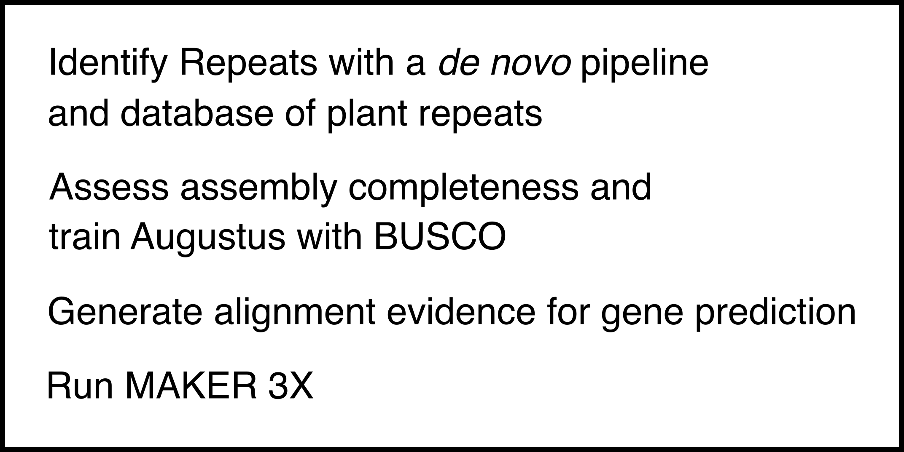

# Pipeline for annotating repeat in the Cascade Hop Dovetail Assembly  

  

# Repeat Annotation
### *de novo* identification of long terminal retrotransposons (LTRs)
gt suffixerator (GenomeTools) 1.6.1  
<code>gt suffixerator -db scaffoldID.fasta -indexname scaffoldID -tis -suf -lcp -des -ssp -dna</code>

gt ltrharvest (GenomeTools) 1.6.1  
<code>gt ltrharvest -index ../index/scaffoldID -out scaffoldID.ltrharvest.out -outinner scaffoldID.ltrharvest.outinner -gff3 scaffoldID.ltrharvest.gff3 -seqids yes > scaffoldID.ltrharvestScreen.out</code>

LTR_FINDER_parallel v1.1  
<code>LTR_FINDER_parallel -seq ../index/scaffoldID.fasta -threads 4 -harvest_out</code>

LTR_retriever v2.7
<code>LTR_retriever -genome ../index/scaffoldID.fasta -inharvest ../ltrharvest/scaffoldID.ltrharvestScreen.out -infinder ../LTR_finder_parallel/scaffoldID.fasta.finder.combine.scn -threads 4 > scaffoldID.ltr_retriever.out</code>

### Identification of non-LTR repeat sequences
RepeatMasker version 4.1.0  
Repeat library: [mipsREdat_9.3p_Eudicot_TEs.fasta](https://www.mmnt.net/db/0/0/ftp.mips.embnet.org/plants/REdat)  
<code>RepeatMasker -lib mipsREdat_9.3p_Eudicot_TEs.fasta -qq -pa 4 -cutoff 225 -norna -a -gff -dir outputDir/ scaffoldID.fasta</code>  
